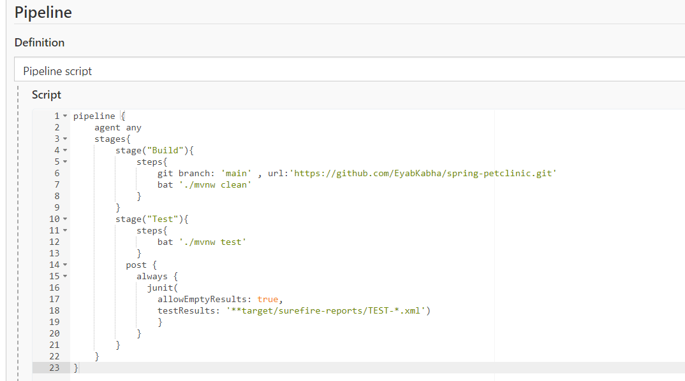
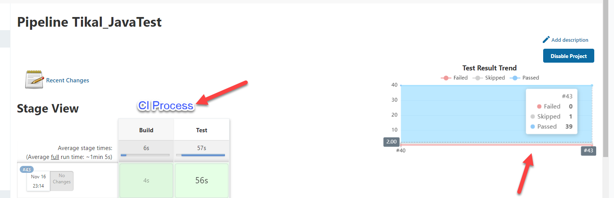
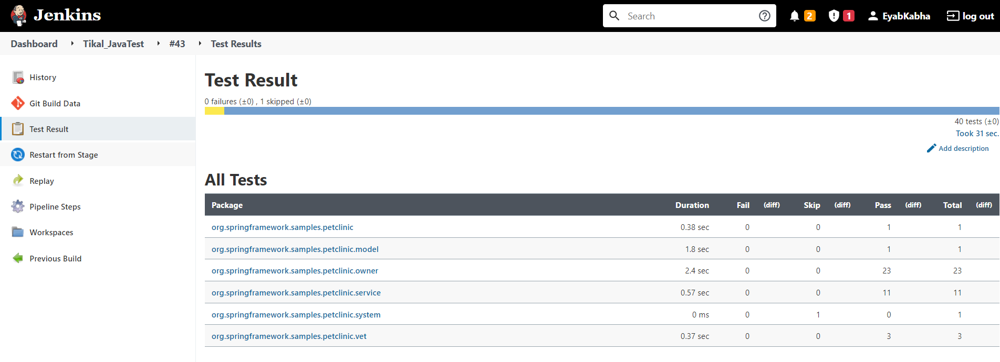

# Continuous integration (CI) Assigment - Eyab Kabha - DevOps Position

**section 1 -**

I used **Jenkins** tool

Why jenkins?
 
- Continuous Integration (CI) where the artifacts are automatically created and tested. This aids in identification of issues in the product at an early stage of development.

- Easy to use and integrate

- Automation testing using test frameworks such as Nose2, PyTest, Robot, Selenium, and more.

# 
**section 2 -**

Forked *spring-projects/spring-petclinic* project from github

* Created A pipleline in Jenkins that will launch CI procces 

## How the pipeline work?

- First step **("Build")**
    - cloing the repository then clean the files and directories generated by Maven during the build.
- Second step **("Test")**
    - run the command *mvnw test* in order to start testing the repository.
- Third step
    - using plugin **Junit** test in order to see the results once done in the dashboard and save the results of the test into xml files, the main purpose of [post --> always] is no matter the result of the test run, always show the results.

### Once we run the Pipeline the results will be as below:

- On the right side of the result we can see how many results ( Passed , Skiped , Failed )

in addition, we can see below  the  list of the tests.

# 

DevOps CI/CD cycle

