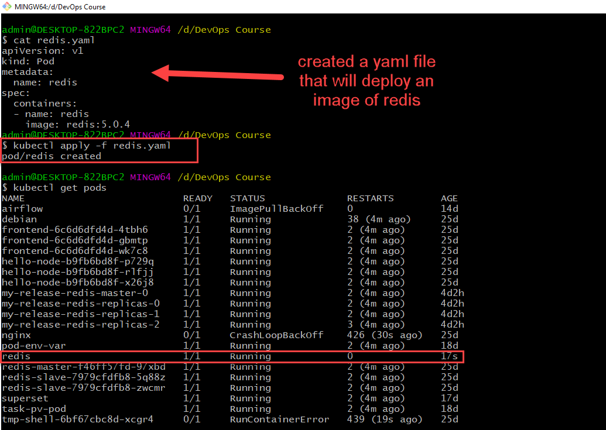
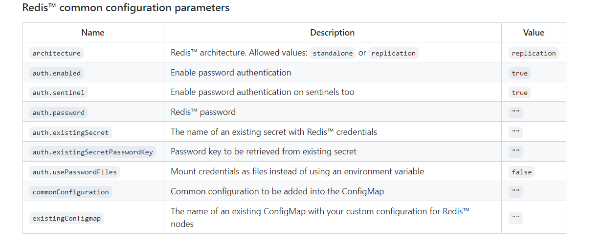
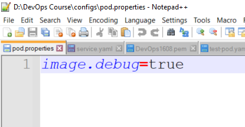
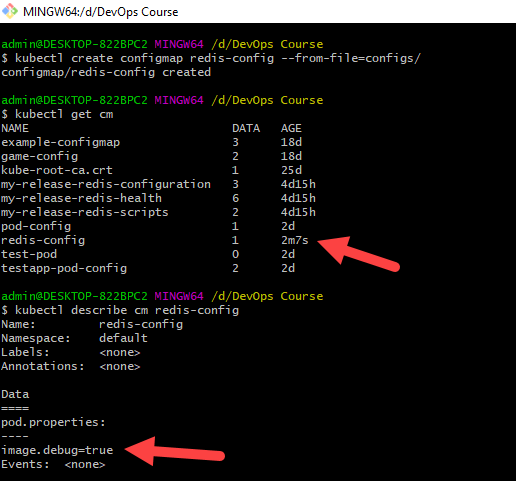
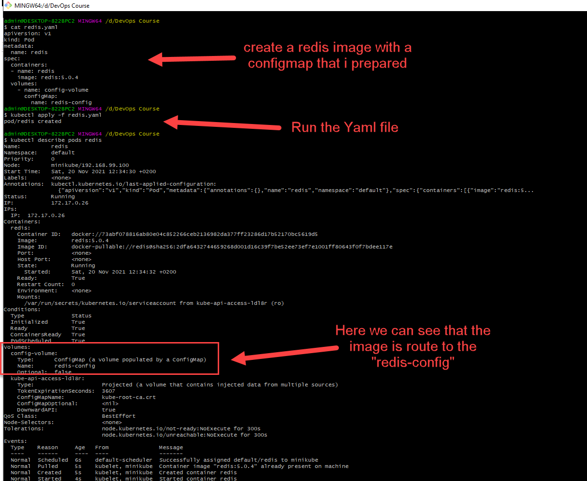

# Kubernetes & Redis Assigment - Eyab Kabha - DevOps Position

**section 1 -**

Deploy Redis with Kubernetes

[](pipeline.png)

```
apiVersion: v1
kind: Pod
metadata:
  name: redis
spec:
  containers:
  - name: redis
    image: redis:5.0.4
```
Regarding the security enabled, i wasn't quiet sure how to do it, but I think the start should be like as below, as mentioned in the documentation, in addition, i thought there is an option to save the password in the secret file of kubernetes.


[](pipeline.png)

# 
**section 2 -**

Added a properties file for later use with the image (Redis)

[](conifg.png)

```
image.debug=true
```

Use the Propertie file and create a configmap

[](createconifgmap.png)

Now i want to run the image with the config map that i created

[](createconifgmap.png)

```
apiVersion: v1
kind: Pod
metadata:
  name: redis
spec:
  containers:
  - name: redis
    image: redis:5.0.4
  volumes:
    - name: config-volume
      configMap: 
        name: redis-config
```
**section 3 [Bonus] -**

i recommend to these redis helm chart below , the reason of that, on this helm chart we can find a lot of examination including the configuration, very clear, and helpful information

https://github.com/bitnami/charts/tree/master/bitnami/redis